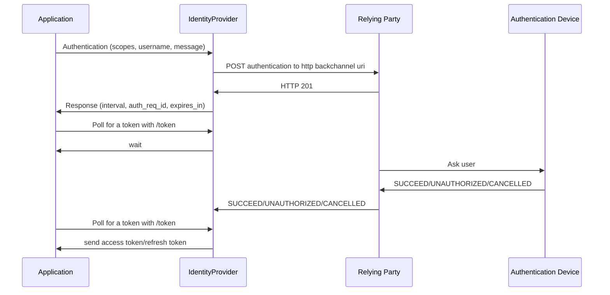

# CIBA authentication implementation in bash


## Requirements

netcat, jq and Keycloak

## Launch Keycloak

```
./kc.sh start-dev --spi-ciba-auth-channel-ciba-http-auth-channel-http-authentication-channel-uri=http://127.0.0.1:8081
```

## Relying-party

```
relying-party.sh --ciba-callback-endpoint
```

Waits for an backchannel authentication request from the identity provider, listening on port 8081.

Asks user for authentication, send back the answer to identity provider.

## ciba-auth

```
ciba-auth.sh --openid-endpoint [--backchannel-authentication-endpoint --token-endpoint] --client-id --client-secret --username --scope --hint
```

Starts a CIBA authentication with the identity provider, then polls for a token.

